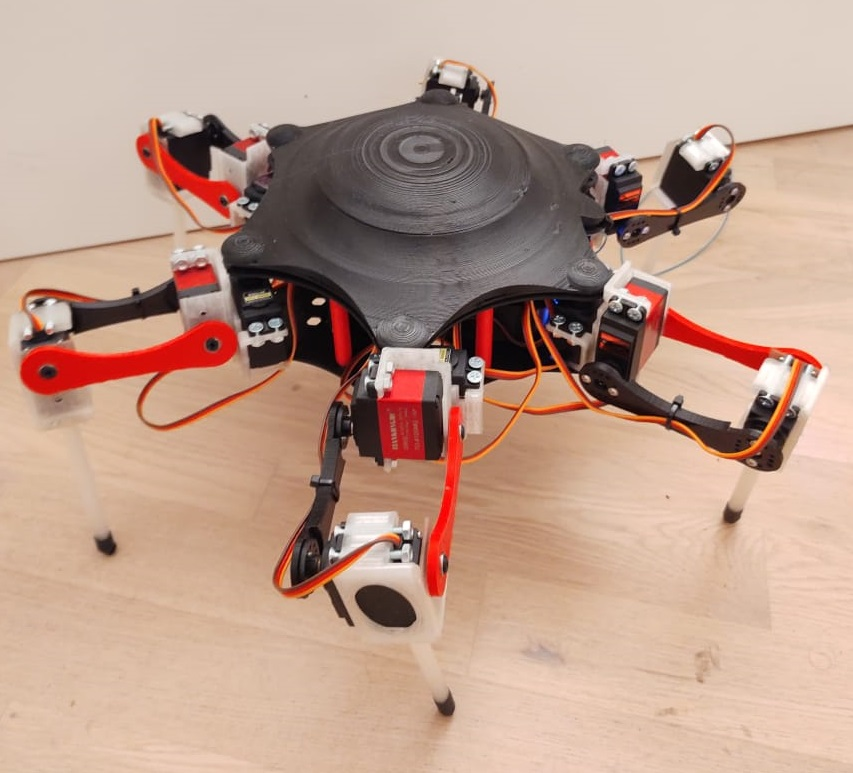
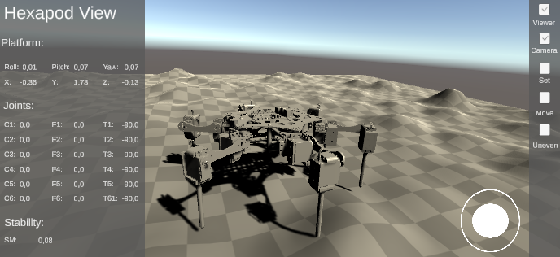
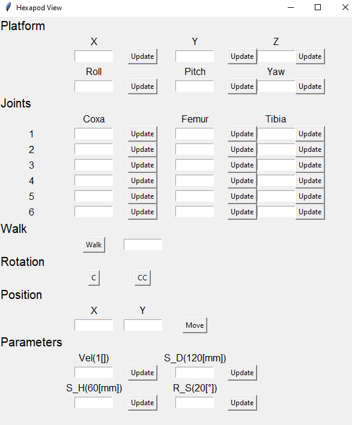
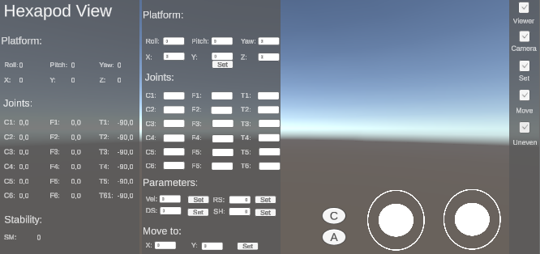
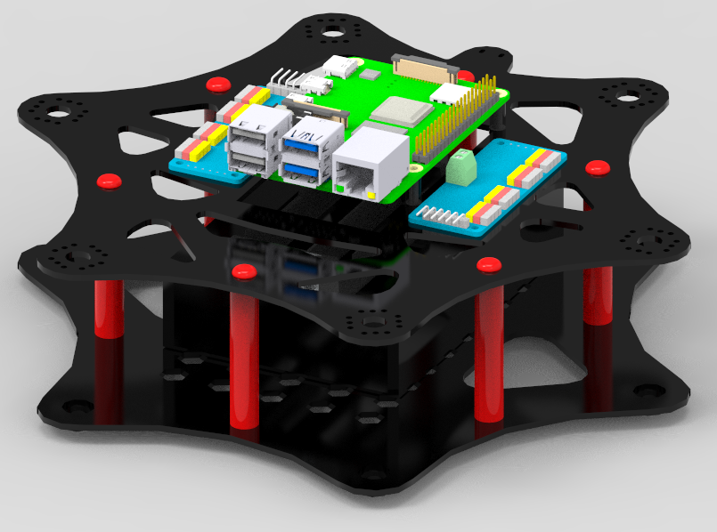

# Teleoperation-Hexapod-Robot

Design, simulation and manufacturing of and hexapod robot with 18 joints.

The full project can be found explained in spanish on *docs/hexapod_robot.pdf*

## Simulation in Unity

Hexapod simulation using Unity. In order to make it work, you need to use Unity 2020.1a15 or later. Unity 2020.1.0b5 was used in the developement.
Just download the Hexapod-Simulation-Unity folder and run the scene. 

Enable terrain Gameobject and disable floor in order to test the robot over an uneven terrain.

## Real robot movement

The robot code runs on a Raspberry Pi 3 Model B. It uses two PCA9685 to move the 18 servomotors of the robot. It is possible to use different ways to control the robot, it is possible to use a Tkinter interface to set the angular position and movement of the robot

It is also possible use a Unity simulation to control the robot via a Wifi connection, this make possible to move the robot from any computer or cellphone connected to internet.

To use a Wifi communication set the WIFI variable in the *main.py* to True. You need to set the IP address to connect in the *wifi.py*. In case the wifi variable is set to False a Tkinter interface will be displayed. 

To run the program use `python main`. This will create two processes, one for doing calculation with 18 threads and another one to write the calculated values on the PCA9685 to move the robot.

In this application we are using two types of motors TD8120 and MG996R. In case a different motor is used, you need to tweak the frequencies on the *servo_process.py* to match the ones from your motors.

All the values to describe the dimentionality of the robot to calculate the inverse kinematics of the legs and the platform are defined in *my_global.py*. Modify the lenghts according to the robot you are using.

## Hexapod models

All the models were designed using Solid Edge and can be found in the Hexapod-Model folder

